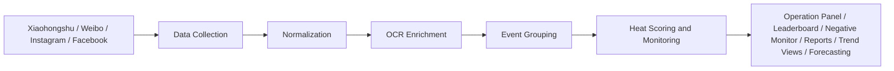

# Macau Resort Analytics Platform

Demo video: [Watch the walkthrough on YouTube](https://youtu.be/6tE8i1ilmtg)

This project addresses a practical data problem: event and campaign information from major Macau casino resort operators and related government accounts is spread across Xiaohongshu, Weibo, Instagram, and Facebook, where content formats differ by platform, the same event may appear multiple times, and key details are sometimes embedded in promotional images rather than captions. As a result, manual tracking, comparison, and reporting can be time-consuming and inconsistent.

The system brings these sources into a single workflow by collecting posts across platforms, standardizing them into a shared structure, extracting additional event information from images with OCR, and grouping similar posts into event-level records. Building on that pipeline, it provides an operation panel, heat leaderboard, negative monitor, report export functions, trend views, and footfall forecasting, so that users can review, filter, rank, monitor, and analyze activity within one system rather than working directly from fragmented platform feeds.

From a business perspective, the project is designed to turn scattered promotional content into a more usable base for monitoring and review. Users can examine activity by operator, category, and date range, track which events are drawing more visible attention, monitor posts linked to negative keywords, export results for reporting, and use trend and forecasting functions to support period-based analysis.

## Quick Start

1. Configure the required API keys and environment variables.
2. Make sure `macau_analytics.db` and `social_media_analytics.db` are in place.
3. Start the application with `python bridge.py`.
4. Open `http://127.0.0.1:9038` in a browser.

Example environment variables:

```env
DASHSCOPE_API_KEY=your_dashscope_key
DEEPSEEK_API_KEY=your_deepseek_key
DEEPSEEK_BASE_URL=https://api.deepseek.com
APIFY_TOKEN=your_apify_token
DB_PATH=C:/path/to/macau_analytics.db
FULL_WEB_ANALYTICS_DB_PATH=C:/path/to/social_media_analytics.db
```

## Key Capabilities

The system supports cross-platform collection from Xiaohongshu, Weibo, Instagram, and Facebook, covering major Macau casino resort operators and selected government accounts. Collected posts are standardized into a shared dataset so that content from different platforms can be reviewed and analyzed in a more consistent way.

To improve event-level visibility, the pipeline extracts text from promotional images with OCR and uses grouped event records instead of treating every post as a separate item. This helps surface duplicated promotions, missing caption details, and cross-platform activity more clearly. On top of that processed data, the system provides an operation panel for filtering by operator, category, and date range, a heat leaderboard for ranked event views, a negative monitor for keyword-based monitoring, report export functions, trend views for period-based analysis, and footfall forecasting as part of the broader analytics workflow.

## System Workflow



At a high level, the workflow starts with collecting posts across Xiaohongshu, Weibo, Instagram, and Facebook. The raw content is then cleaned and standardized into a shared structure, after which OCR is used to extract additional event details from images where necessary. Once the data is enriched, similar posts are grouped into event-level records so that duplicated promotions can be reviewed as single activities rather than separate posts.

After grouping, the system calculates heat scores and prepares the processed data for dashboard views, monitoring functions, and reporting outputs. This allows users to move from raw platform posts to a more structured workflow for filtering, ranking, monitoring, exporting, and reviewing activity over time.

## Repository Structure

The repository is organized around several connected parts of the workflow. Core scripts such as `bridge.py`, `db_manager.py`, and `task_manager.py` handle API-facing logic, data access, orchestration, and monitoring workflows. Supporting scripts such as `media_analyzer.py`, `process_events.py`, and `heat_analyzer.py` handle OCR enrichment, event grouping, and heat-score generation, while the negative keyword monitor is supported through dedicated crawling, ingestion, and query flows for tracked keywords across platforms.

Other parts of the repository extend the same overall workflow. The `full_web_sidecar/` directory supports full-web heat analysis, trend views, and cluster-based analysis, while the `footfall/` directory supports forecasting-related analysis. The `data/` directory stores supporting databases and inputs, and `mediacrawler_patches/` contains project-specific crawler modifications used in data collection.

User-facing functionality is exposed through browser-based pages and views such as the operation panel, heat leaderboard, full-web heat analysis pages, negative monitor, login page, admin page, and report-related views. These pages provide the main entry points for reviewing processed activity, filtering results, monitoring tracked keywords, exploring trend outputs, and exporting results.

## Setup and Usage

The project depends on a local setup that combines this repository with crawler access, API keys, and SQLite databases. The main monitoring workflow uses `macau_analytics.db` for event records, processed posts, cached analysis results, and user-related data. A separate database, `social_media_analytics.db`, is used for the full-web heat analysis workflow. Some collection steps depend on a configured MediaCrawler environment for Xiaohongshu and Weibo, while external API services are used for OCR, embeddings, Instagram/Facebook data collection, event extraction, hot themes, and recommendations.

After the required environment variables and dependencies are configured, the main application can be started through `bridge.py`, which serves the dashboard pages and API routes used by the operation panel, heat leaderboard, negative monitor, full-web analysis pages, and related views. Depending on the workflow being used, supporting scripts such as `media_analyzer.py`, `process_events.py`, and `heat_analyzer.py` can be run separately to enrich OCR text, group posts into event-level records, and calculate heat scores before reviewing the results in the interface.

Different parts of the system are used for different tasks, including data collection, processing, monitoring, review, and reporting.

## Data Model and Databases

The project uses SQLite as its main storage layer for both operational workflows and analysis outputs. The primary database, `macau_analytics.db`, supports the main monitoring system and stores collected event-related content, processed post records, grouped event records, cached analysis outputs, heat-related results, crawl logs, and user-related data used by the application interface.

Within that workflow, raw and normalized social posts are stored separately so that content from different platforms can be cleaned, enriched, and reused in later stages of processing. OCR results, embeddings, grouped event records, heat scores, and cached outputs such as analysis results, hot themes, recommendations, and leaderboard-related data are also stored in the database so that the system does not need to recompute every step each time a user opens the interface.

A separate database, `social_media_analytics.db`, is used for the full-web heat analysis workflow. This supports the trend, cluster, and broader review views exposed through the full-web analysis pages. Keeping that workflow in a separate database allows the project to support different analysis paths without mixing all outputs into the same store.

## Limitations

Several limitations should be acknowledged, as they may affect data completeness, accuracy, and timeliness.

First, the system faces data-volume constraints. Under the monthly free tier of Apify, only ten posts are collected per account in each crawl cycle. This means older discussions may not always be captured, and the dataset may be biased toward more recent or more visible posts.

Second, the seven-day crawling interval introduces a delay in data availability. This design helps reduce the risk of platform restrictions or account issues, but it also means the system is less suitable for near real-time monitoring. New events or emerging trends may not appear immediately in the dataset.

Third, event date extraction remains challenging because social media content is often unstructured. A single post may contain multiple date references, such as ticket-sale dates, event durations, or promotional periods. As a result, the same event may be assigned different dates across posts, which can affect event grouping and reporting accuracy.

Fourth, the deduplication process is not fully precise. Although the system groups posts based on textual similarity, differences in wording, tone, or expression can lead to incomplete clustering. Posts referring to the same event may still be treated as separate entries, which in turn affects event counts, rankings, and heat scores.

Finally, the current heat-score mechanism does not distinguish between positive and negative engagement. Likes, comments, and shares are treated as indicators of visibility rather than sentiment, so events receiving criticism or complaints may still appear highly ranked.

Overall, the platform provides useful analytical support, but its outputs should be interpreted with these limitations in mind.

## Future Improvements

Several improvements could further increase the analytical and business value of the platform.

First, the breadth and volume of data collection could be expanded. Increasing crawl volume and incorporating additional platforms such as Threads and Trip.com would make the dataset more representative and reduce sampling bias. Exploring paid collection tiers or distributing crawls across multiple accounts could also help address the current limits on crawl volume.

Second, the crawling cycle could be shortened for short-window events such as concerts, seasonal promotions, and campaign-based activities. A more frequent or event-triggered collection mechanism would allow the system to capture emerging trends more quickly and improve the timeliness of monitoring outputs.

Third, the accuracy of event date extraction and deduplication could be improved further. Social posts often contain multiple date references, including ticket-sale dates, promotional periods, and actual event dates, and the current workflow does not always separate them consistently. A more structured extraction prompt with clearer prioritization rules could improve date consistency. Deduplication performance could also be strengthened by using a more domain-specific or fine-tuned similarity model.

Fourth, the platform could be extended to analyze video content more directly. At present, image-based OCR helps recover information from promotional visuals, but video posts may still contain important event details in spoken audio, subtitles, or embedded visuals that are not fully captured. Adding a dedicated video-analysis workflow would improve coverage for video-heavy promotional content.

Fifth, the heat-score mechanism could be refined by incorporating sentiment analysis. At the moment, engagement is treated primarily as a visibility signal, regardless of whether the response is positive or negative. Distinguishing between positive and negative engagement would provide a more balanced view of event performance.

Finally, the platform could be strengthened by linking social activity with business performance indicators such as occupancy rates, revenue, or profitability. This would make it possible to examine whether changes in social engagement are associated with operational outcomes for Wynn and its competitors, and would move the system closer to business performance analysis rather than promotional monitoring alone.
